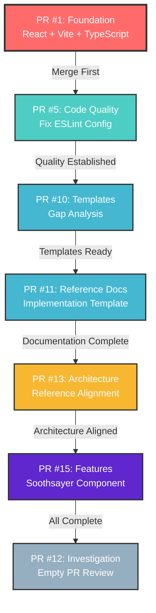

# 🌿 Pull Request Gardening Roadmap

## Visual Cascade Map



## Timeline Estimate

```
Week 1: Foundation & Quality
├── Day 1-2: PR #1 Review & Testing
├── Day 3: PR #1 Merge
├── Day 4: PR #5 Review & Testing
└── Day 5: PR #5 Merge

Week 2: Process Templates
├── Day 1-2: PR #10 Review
├── Day 3: PR #10 Merge
├── Day 4: PR #11 Review
└── Day 5: PR #11 Merge

Week 3: Architecture & Features
├── Day 1-2: PR #13 Review & Documentation
├── Day 3: PR #13 Merge
├── Day 4: PR #15 Review & Testing
└── Day 5: PR #15 Merge

Week 4: Cleanup
├── Day 1: PR #12 Investigation
├── Day 2: PR #12 Resolution
└── Day 3-5: Final validation & documentation
```

## Priority Matrix

```
┌─────────────────────────────────────────────────┐
│  HIGH PRIORITY         │  MEDIUM PRIORITY       │
│  ─────────────         │  ───────────────       │
│  PR #1 (Foundation)    │  PR #10 (Templates)    │
│  PR #5 (Code Quality)  │  PR #11 (Ref Docs)     │
│  PR #13 (Architecture) │  PR #15 (Features)     │
├─────────────────────────────────────────────────┤
│  LOW PRIORITY          │  INVESTIGATION         │
│  ─────────────         │  ──────────────        │
│                        │  PR #12 (Empty)        │
└─────────────────────────────────────────────────┘
```

## Dependency Graph

```
                         ┌──────────────┐
                         │   PR #1      │
                         │  Foundation  │
                         └──────┬───────┘
                                │
                                ↓
                         ┌──────────────┐
                         │   PR #5      │
                         │ Code Quality │
                         └──────┬───────┘
                                │
                ┌───────────────┴───────────────┐
                ↓                               ↓
         ┌──────────────┐              ┌──────────────┐
         │   PR #10     │              │   PR #11     │
         │  Gap Analysis│              │ Reference Doc│
         └──────┬───────┘              └──────┬───────┘
                │                              │
                └──────────────┬───────────────┘
                               ↓
                        ┌──────────────┐
                        │   PR #13     │
                        │ Architecture │
                        └──────┬───────┘
                               │
                               ↓
                        ┌──────────────┐
                        │   PR #15     │
                        │   Features   │
                        └──────┬───────┘
                               │
                               ↓
                        ┌──────────────┐
                        │   PR #12     │
                        │Investigation │
                        └──────────────┘
```

## Success Metrics

### Quality Gates
- ✅ All PRs pass linting
- ✅ All PRs build successfully
- ✅ No security vulnerabilities introduced
- ✅ Documentation is updated
- ✅ No merge conflicts
- ✅ Code review approved

### Process Metrics
- **Target Completion**: 3-4 weeks
- **Current Progress**: 0/7 PRs merged
- **Blockers**: None identified yet
- **Risk Level**: 🟢 Low

### Team Engagement
- **Reviewers Needed**: 1-2 per PR
- **Testing Required**: Local for PRs #1, #5, #15
- **Documentation Updates**: All PRs

## Communication Plan

### Daily Standup Topics
1. Which PR is being reviewed today?
2. Any blockers encountered?
3. Expected completion date for current PR?
4. Any help needed from team?

### Weekly Checkpoints
- **Monday**: Review previous week's progress
- **Wednesday**: Mid-week status update
- **Friday**: Plan next week's PRs

### Notifications
- 🔔 Notify team when PR is ready for review
- 🔔 Notify when PR is merged
- 🔔 Notify if blocker is encountered
- 🔔 Celebrate milestone completions!

## Risk Management

### Identified Risks
1. **Merge Conflicts**: Possible between PRs
   - *Mitigation*: Rebase frequently
2. **Breaking Changes**: PRs may conflict
   - *Mitigation*: Test each merge thoroughly
3. **Scope Creep**: Additional work discovered
   - *Mitigation*: Track in separate issues
4. **Time Delays**: Reviews take longer than expected
   - *Mitigation*: Set realistic timelines

### Contingency Plans
- If PR #1 has issues: Fix inline or create new PR
- If conflicts arise: Coordinate with PR authors
- If timeline slips: Adjust milestone dates
- If blockers persist: Escalate to team lead

## Celebration Milestones 🎉

- 🎊 **Milestone 1**: PR #1 merged (Foundation Complete)
- 🎊 **Milestone 2**: PR #5 merged (Quality Tooling Ready)
- 🎊 **Milestone 3**: PRs #10 & #11 merged (Templates Available)
- 🎊 **Milestone 4**: PR #13 merged (Architecture Aligned)
- 🎊 **Milestone 5**: PR #15 merged (Features Added)
- 🎊 **Milestone 6**: All 7 PRs Complete! 🚀

## Resources

### Documentation
- [PR_GARDENING_TRACKER.md](../PR_GARDENING_TRACKER.md) - Detailed task lists
- [CONTRIBUTING.md](../CONTRIBUTING.md) - Contribution guidelines
- [ARCHITECTURE.md](../ARCHITECTURE.md) - Architecture overview

### Tools
- GitHub PR Review Interface
- Local development environment
- Git command line
- CodeQL security scanning

### Help & Support
- Team chat channel
- GitHub issue tracker
- Documentation wiki
- Code review guidelines

---

**Created**: 2025-11-09  
**Last Updated**: 2025-11-09  
**Status**: 🟡 Active  
**Next Review**: After PR #1 decision
