# 🌿 Pull Request Gardening - Complete Guide

## Executive Summary

This repository contains **7 open pull requests** that require coordinated review, testing, and merging. This guide establishes a systematic approach to "garden" these PRs through a **cascading merge strategy** that respects dependencies and minimizes merge conflicts.

---

## 📋 Table of Contents

1. [Quick Start](#quick-start)
2. [Documentation Index](#documentation-index)
3. [The 7 Pull Requests](#the-7-pull-requests)
4. [Dependency Flow](#dependency-flow)
5. [Review Process](#review-process)
6. [Timeline & Milestones](#timeline--milestones)
7. [FAQs](#faqs)

---

## Quick Start

### For Reviewers
1. Read the [Quick Reference](./.github/PR_GARDENING_QUICK_REF.md)
2. Check the [Visual Roadmap](./.github/PR_GARDENING_ROADMAP.md)
3. Start with PR #1 in the [Tracker](../PR_GARDENING_TRACKER.md)
4. Follow the cascade order strictly

### For Contributors
1. Understand the [dependency chain](#dependency-flow)
2. Avoid making changes to PRs in review
3. Respond to review feedback promptly
4. Coordinate with team on merge timing

### For Project Managers
1. Monitor progress in the [Tracker](../PR_GARDENING_TRACKER.md)
2. Review weekly status updates
3. Escalate blockers immediately
4. Celebrate milestone completions

---

## Documentation Index

This gardening initiative includes 4 key documents:

| Document | Purpose | Audience |
|----------|---------|----------|
| **[PR_GARDENING_TRACKER.md](../PR_GARDENING_TRACKER.md)** | Detailed task lists, dependencies, and progress tracking | Reviewers, Contributors |
| **[PR_GARDENING_ROADMAP.md](./.github/PR_GARDENING_ROADMAP.md)** | Visual diagrams, timeline, and risk management | Project Managers, Team Leads |
| **[PR_GARDENING_QUICK_REF.md](./.github/PR_GARDENING_QUICK_REF.md)** | At-a-glance status and quick actions | Everyone |
| **This Document** | Complete overview and integration guide | All Stakeholders |

---

## The 7 Pull Requests

### 1. PR #1 - Foundation 🏗️
**Branch**: `copilot/build-perp-trading-site`  
**Status**: 🟡 Open  
**Priority**: **CRITICAL**

**What It Does**: Implements the core React + Vite + TypeScript perpetual futures trading interface with Solana wallet integration and Drift Protocol SDK.

**Why It's First**: This is the foundation upon which all other PRs depend. It establishes the base application structure, wallet connection, and trading functionality.

**Review Focus**:
- Wallet adapter configuration
- Drift SDK integration
- Trading panel implementation
- Error handling

**Estimated Review Time**: 2-3 days

---

### 2. PR #5 - Code Quality 🔧
**Branch**: `copilot/fix-eslint-import-path`  
**Status**: 🟡 Open  
**Priority**: **HIGH**

**What It Does**: Fixes invalid ESLint configuration by removing incorrect `eslint/config` imports and migrating to proper flat config syntax.

**Why It's Second**: Establishes code quality tooling that will be used for all subsequent PRs.

**Review Focus**:
- ESLint flat config syntax
- Node.js globals configuration
- Linting passes on all files

**Estimated Review Time**: 1 day

---

### 3. PR #10 - Gap Analysis Template 📊
**Branch**: `copilot/create-gap-analysis-template`  
**Status**: 🟡 Open  
**Priority**: **MEDIUM**

**What It Does**: Adds comprehensive gap analysis template for organizational alignment with priority-based categorization framework.

**Why It's Third**: Provides process templates that may be referenced in architecture docs.

**Review Focus**:
- Template completeness
- Example clarity
- Organizational applicability

**Estimated Review Time**: 1 day

---

### 4. PR #11 - Reference Implementation Template 📖
**Branch**: `copilot/add-reference-implementation-section`  
**Status**: 🟡 Open  
**Priority**: **MEDIUM**

**What It Does**: Creates template for declaring reference implementation patterns and architectural standards.

**Why It's Fourth**: Establishes reference documentation framework before documenting specific architecture.

**Review Focus**:
- Documentation structure
- Link validity
- Template reusability

**Estimated Review Time**: 1 day

---

### 5. PR #13 - Architecture Alignment 🏛️
**Branch**: `copilot/align-project-goals-documentation`  
**Status**: 🟡 Open  
**Priority**: **HIGH**

**What It Does**: Documents spark/4444JPP/perpetual-future as canonical reference with 4-phase roadmap and comprehensive gap analysis.

**Why It's Fifth**: Uses templates from PRs #10 and #11 to document architecture alignment.

**Review Focus**:
- Roadmap completeness
- Gap analysis accuracy
- Alignment metrics validation

**Estimated Review Time**: 2 days

---

### 6. PR #15 - Soothsayer Feature 🔮
**Branch**: `copilot/add-predictive-analysis-feature`  
**Status**: 🟡 Open  
**Priority**: **MEDIUM**

**What It Does**: Adds Soothsayer predictive analysis component with 10 curated insights across 4 categories.

**Why It's Sixth**: New feature that builds on the established foundation and architecture.

**Review Focus**:
- Component implementation
- UI integration
- Data structure
- No conflicts with existing code

**Estimated Review Time**: 1-2 days

---

### 7. PR #12 - Investigation 🔍
**Branch**: `4444JPP-patch-1`  
**Status**: 🔴 Needs Investigation  
**Priority**: **LOW**

**What It Does**: Unknown - PR contains no file changes or descriptions.

**Why It's Last**: Needs investigation before action can be taken. Processed last to avoid blocking other work.

**Review Focus**:
- Determine intent
- Identify if it should be closed
- Or if changes need to be added

**Estimated Review Time**: 30 minutes investigation

---

## Dependency Flow

```mermaid
graph TD
    Start([Start Gardening]) --> PR1[PR #1: Foundation]
    PR1 -->|Merged| PR5[PR #5: Code Quality]
    PR5 -->|Merged| Split{Templates}
    Split -->|Parallel| PR10[PR #10: Gap Analysis]
    Split -->|Parallel| PR11[PR #11: Reference Docs]
    PR10 -->|Merged| Merge{Converge}
    PR11 -->|Merged| Merge
    Merge --> PR13[PR #13: Architecture]
    PR13 -->|Merged| PR15[PR #15: Soothsayer]
    PR15 -->|Merged| PR12[PR #12: Investigation]
    PR12 -->|Resolved| End([Complete! 🎉])
    
    style Start fill:#4ecdc4
    style PR1 fill:#ff6b6b,stroke:#333,stroke-width:3px
    style PR5 fill:#4ecdc4
    style PR10 fill:#45b7d1
    style PR11 fill:#45b7d1
    style PR13 fill:#f7b731
    style PR15 fill:#5f27cd
    style PR12 fill:#95afc0
    style End fill:#26de81
```



### Critical Path
The **critical path** is the sequence that must be completed in order:
```
PR #1 → PR #5 → (PR #10 || PR #11) → PR #13 → PR #15 → PR #12
```

### Parallel Work
PRs #10 and #11 can be reviewed and merged in parallel after PR #5 is complete, potentially saving 1 day in the timeline.

---

## Review Process

### Phase 1: Pre-Review Preparation
1. **Read the PR description** - Understand what's being changed
2. **Check dependencies** - Verify prerequisites are merged
3. **Review tracker tasks** - Know what to look for
4. **Set up local environment** - Ready for testing

### Phase 2: Code/Documentation Review
1. **Review changes** - Line-by-line examination
2. **Check quality** - Linting, building, standards
3. **Verify documentation** - Updates are complete
4. **Test functionality** - Everything works as expected

### Phase 3: Feedback & Iteration
1. **Provide feedback** - Clear, actionable comments
2. **Request changes** - If needed
3. **Approve** - When satisfied
4. **Communicate** - Keep team informed

### Phase 4: Merge & Update
1. **Merge the PR** - Follow merge strategy
2. **Update tracker** - Mark tasks complete
3. **Notify team** - Announce progress
4. **Prepare next PR** - Move to next in cascade

---

## Timeline & Milestones

### 4-Week Plan

#### Week 1: Foundation & Quality
**Goal**: Establish base application and code quality tools

- **Days 1-2**: PR #1 review and testing
- **Day 3**: PR #1 merge
- **Day 4**: PR #5 review and testing  
- **Day 5**: PR #5 merge

**Milestone 1**: ✅ Foundation Complete (29% done)

---

#### Week 2: Process Templates
**Goal**: Add organizational process documentation

- **Days 1-2**: PR #10 and PR #11 reviews (parallel)
- **Day 3**: PR #10 merge
- **Day 4**: PR #11 merge
- **Day 5**: Buffer/documentation updates

**Milestone 2**: ✅ Templates Available (57% done)

---

#### Week 3: Architecture & Features
**Goal**: Align architecture and add new functionality

- **Days 1-2**: PR #13 review and documentation validation
- **Day 3**: PR #13 merge
- **Day 4**: PR #15 review and testing
- **Day 5**: PR #15 merge

**Milestone 3**: ✅ Features Complete (86% done)

---

#### Week 4: Cleanup & Celebration
**Goal**: Resolve remaining items and finalize documentation

- **Day 1**: PR #12 investigation
- **Day 2**: PR #12 resolution (merge or close)
- **Day 3**: Final documentation updates
- **Day 4**: Complete testing and validation
- **Day 5**: Team celebration and retrospective

**Milestone 4**: ✅ All PRs Complete! 🎉 (100% done)

---

## FAQs

### Q: Why can't we merge PRs in a different order?
**A**: The dependency chain ensures that:
- Foundation code is established before enhancements
- Quality tools are in place before major changes
- Templates exist before they're used
- Architecture is documented before features are added

Merging out of order risks merge conflicts, breaking changes, and rework.

### Q: What if a PR review takes longer than expected?
**A**: Adjust the timeline accordingly. The 4-week estimate has some buffer built in, but quality is more important than speed. Update the tracker with new estimates.

### Q: Can we skip PR #12 if it's empty?
**A**: Yes, after investigation. If it truly has no purpose, it can be closed with an explanation. This is why it's last in the queue.

### Q: What if we discover issues during review?
**A**: Document them in the PR comments and work with the author to resolve them. Update the tracker to reflect blockers and adjusted timelines.

### Q: Who approves each PR?
**A**: At least one reviewer must approve. For critical PRs (#1, #5, #13), consider requiring two approvals for added safety.

### Q: What if there are merge conflicts?
**A**: The PR author should rebase their branch onto the latest main. This is why following the cascade order is critical - it minimizes conflicts.

### Q: How often should we update the tracker?
**A**: After every significant action:
- After completing a review
- After merging a PR
- When encountering a blocker
- At the end of each week

### Q: What happens after all PRs are merged?
**A**: 
1. Update all documentation to reflect current state
2. Run full regression testing
3. Close this tracking PR
4. Hold a team retrospective
5. Celebrate the successful gardening! 🎉

---

## Success Metrics

### Quantitative Metrics
- ✅ 7/7 PRs merged
- ✅ 0 regressions introduced
- ✅ 100% of quality checks passing
- ✅ All documentation updated
- ✅ Timeline met (±1 week acceptable)

### Qualitative Metrics
- ✅ Team understands cascade approach
- ✅ Process improvements identified
- ✅ Communication was effective
- ✅ Technical debt was managed
- ✅ Knowledge was shared across team

---

## Risk Management

### Identified Risks

1. **Merge Conflicts**
   - *Probability*: Medium
   - *Impact*: Medium
   - *Mitigation*: Follow cascade order, rebase frequently

2. **Timeline Delays**
   - *Probability*: High
   - *Impact*: Low
   - *Mitigation*: Buffer time built in, adjust as needed

3. **Breaking Changes**
   - *Probability*: Low
   - *Impact*: High
   - *Mitigation*: Thorough testing, rollback plan ready

4. **Review Availability**
   - *Probability*: Medium
   - *Impact*: Medium
   - *Mitigation*: Multiple reviewers identified, async reviews

---

## Conclusion

This Pull Request Gardening initiative provides a **systematic, documented approach** to managing the 7 open PRs in the repository. By following the cascade order, using the tracking documents, and maintaining clear communication, the team can successfully integrate all pending work while minimizing risks and maintaining code quality.

**Key Takeaways**:
- 📋 Use the tracker for detailed tasks
- 🗺️ Refer to the roadmap for big picture
- 📝 Check quick reference for at-a-glance status
- 🔄 Follow the cascade order strictly
- 🎯 Focus on quality over speed
- 🎉 Celebrate milestones along the way

---

**Document Version**: 1.0  
**Created**: 2025-11-09  
**Status**: 🟢 Active  
**Next Review**: After PR #1 merge

---

**Ready to begin? Start with [PR #1 in the Tracker](../PR_GARDENING_TRACKER.md#pr-1-build-react--vite--typescript-perpetual-futures-trading-site)!**
